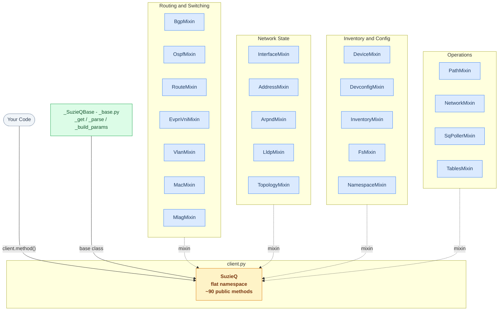
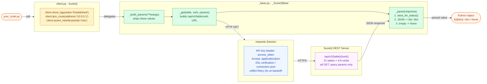
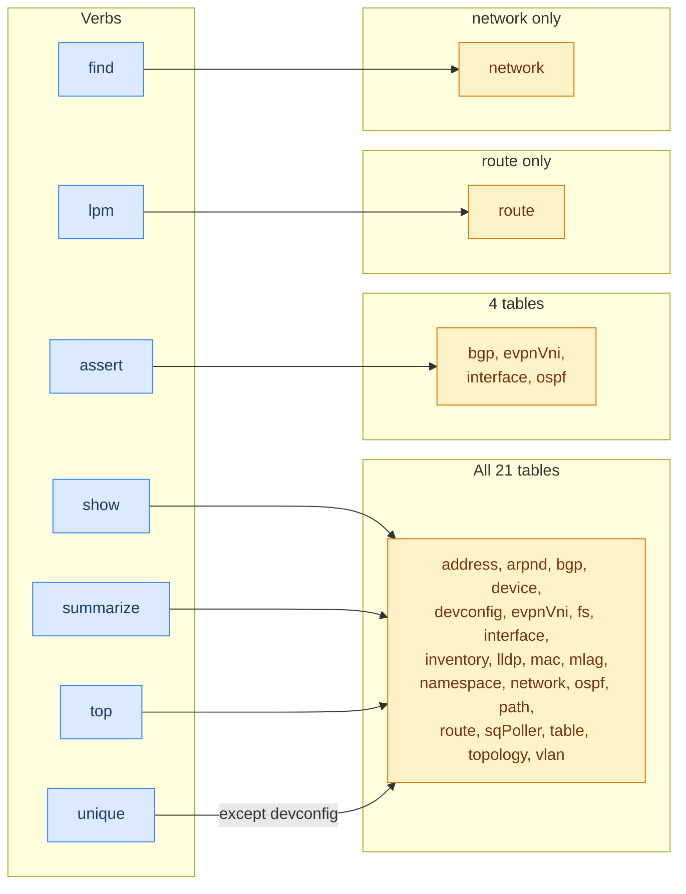

# Architecture Diagrams — suzieq-api-wrapper

## Package composition

`SuzieQ` (in `client.py`) is built by multiple-inheriting from `_SuzieQBase`
and one mixin class per SuzieQ table.  Dashed arrows represent mixin
inheritance; the solid arrow represents the base-class relationship.

---

## Request lifecycle

What happens at runtime when any method on the client is called.

---

## Verb availability

Which verbs are available on which tables.

---

*See [ARCHITECTURE.md](ARCHITECTURE.md) for the decision record behind each design choice.*
